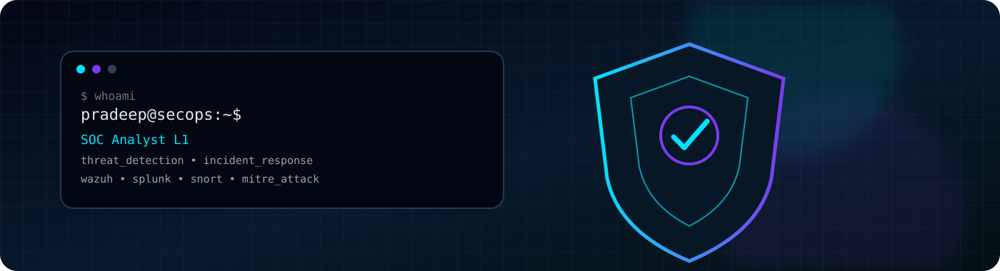

<div align="center">

<!-- HERO BANNER -->
<p align="center">
  
</p>

<!-- 3D CYBERPUNK WAVING HEADER -->


<br/>

<!-- ANIMATED TYPING HEADER -->
<a href="https://git.io/typing-svg">
  
</a>

<br/><br/>

<!-- BADGES MATRIX -->
<a href="https://www.linkedin.com/in/pradeep-kumar-pk01"></a>
<a href="https://github.com/cipher-rp"></a>
<a href="https://komarev.com/ghpvc/?username=cipher-rp&color=00f2fe&style=for-the-badge&label=PROFILE%20VIEWS"></a>

</div>

---

## 🛡️ Security Operations Profile

I'm a **Cybersecurity professional focused on SOC operations, detection engineering, threat hunting, and incident response**.

My current work and learning revolve around turning security telemetry into actionable investigations — from **Windows/Linux logs and endpoint events** to **SIEM correlation, network detection, and MITRE ATT&CK mapping**.

```text
┌──────────────────────────────────────────────────────────────┐
│  SOC WORKFLOW                                                │
│                                                              │
│  TELEMETRY → DETECTION → TRIAGE → INVESTIGATION → RESPONSE │
│       │           │          │            │             │    │
│   Sysmon      Wazuh/SIEM   Alerts      Threat Hunt    IR   │
│   Windows     Splunk       Correlation  Timeline      RCA  │
│   Linux       Snort        MITRE ATT&CK  Evidence     Fix  │
└──────────────────────────────────────────────────────────────┘

🎯 What I Work On
🔎 SOC monitoring & alert investigation
🧠 Threat hunting & detection engineering
🛡️ Wazuh / SIEM / EDR telemetry analysis
🌐 Network detection with Snort & Wireshark
🧩 MITRE ATT&CK-based investigation
🚨 Incident triage, correlation & response
🐧 Linux + Windows security monitoring
🐍 Python automation for cybersecurity
📊 Splunk queries & practical log analysis
⚔️ Featured Security Projects
🧠 CogniSOC — AI-Driven Network Threat Detection & Response
Enterprise-focused security monitoring platform integrating host and network telemetry.

Stack: Wazuh Snort OpenSearch MITRE ATT&CK Active Response Docker

📡 HIDS + NIDS security monitoring
⚡ Detection & alert correlation
🎯 MITRE ATT&CK mapping
🛡️ Automated response workflows
📊 SOC-style investigation dashboard
🔗 View CogniSOC Repository →

🛰️ AEDP — Advanced Enterprise Detection Platform
Detection engineering project designed around enterprise-scale security telemetry.

Focus: Windows Events Sysmon Auditd FIM YARA Sigma MITRE ATT&CK Wazuh

🔑 Authentication & brute-force detections
💻 Process / LOLBin / PowerShell monitoring
🌐 Network activity detection
📁 File Integrity Monitoring (FIM)
🕵️ Threat intelligence correlation
🚨 Behavioral detection and response
🔬 Security Labs & Research
Hands-on experience & research across core tools:

Snort NIDS • Wazuh • TheHive • Splunk • Wireshark • Burp Suite • Nmap • Metasploit • Kali Linux • Docker • DVWA • OWASP Mutillidae II

📜 Certifications & Highlights
🛡️ Certified Ethical Hacker (CEH)
🔐 Cybersecurity & Digital Forensics
🧠 Foundation Level Threat Intelligence Analyst
🏆 Top Performer PoC Award — DevFest Ranchi 2025
🎓 Bachelor's in Computer Application & Cybersecurity — Jharkhand Raksha Shakti University
🧰 Security Arsenal & Technical Stack
Tech stack

SIEMNIDSIRATT&CK

WiresharkBurp SuiteNmapMetasploitDocker

📊 GitHub Telemetry & Stats
GitHub statsTop languages

GitHub streak

🧊 3D Contribution Intelligence
3D GitHub contribution graph
🐍 Contribution Attack Path
GitHub contribution snake
🧭 Current Focus
yaml


role: SOC Analyst L1
focus:
  - Threat Detection
  - Incident Response
  - Threat Hunting
  - Detection Engineering
  - SIEM Investigation
learning:
  - Splunk
  - Advanced Wazuh
  - Microsoft Sentinel
  - MITRE ATT&CK
  - Enterprise Detection Engineering
mindset:
  - Investigate the signal
  - Correlate the evidence
  - Understand the timeline
  - Respond with confidence
📫 Connect & Collaborate
LinkedInGitHub


“Security is not just about finding alerts — it's about understanding what happened.” ⚡
