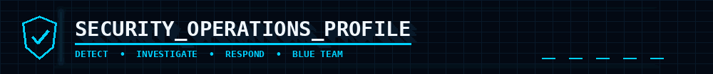
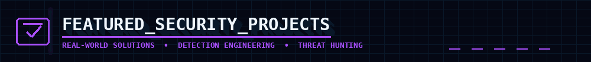
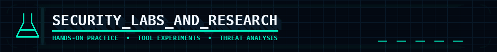
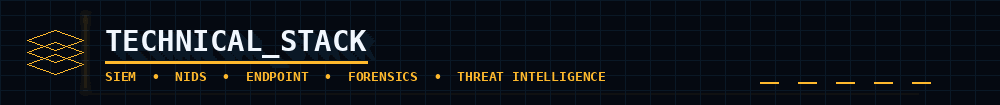
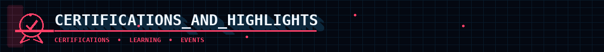
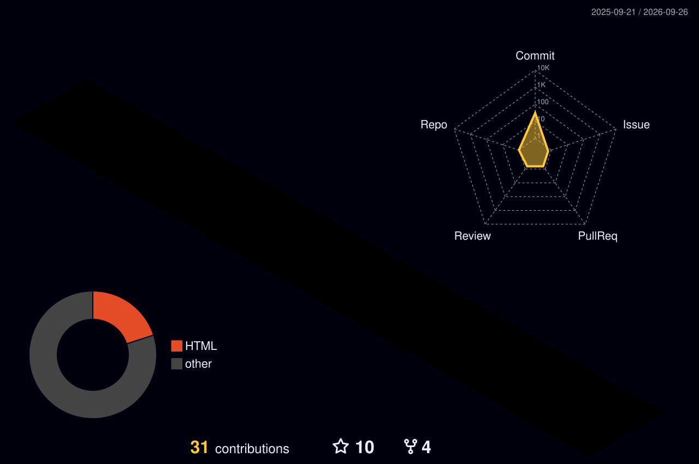
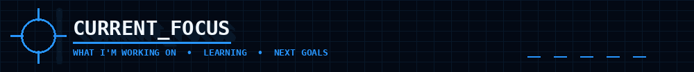
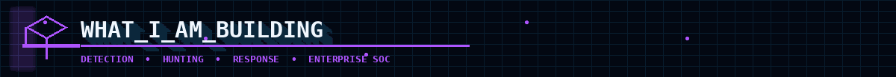
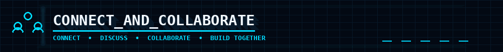

<div align="center">

<p></p>


<a href="https://readme-typing-svg.demolab.com"></a>

<br/>

<p align="center">
  <b>🟢 BLUE TEAM • DETECT • HUNT • INVESTIGATE • RESPOND</b>
</p>

<br/>

<a href="https://www.linkedin.com/in/pradeep-kumar-pk01"></a>
<a href="https://github.com/cipher-rp"></a>


</div>

---

<p align="center"></p>
I'm a **SOC Analyst L1 / Cybersecurity professional** focused on **security monitoring, threat detection, threat hunting, detection engineering and incident response** — with a practical, investigation-first approach.

I work with telemetry from **Windows/Linux endpoints, network sensors and SIEM platforms**, turning raw events into investigation timelines, correlated findings and actionable response steps.

### 🎯 Core Focus

| Area | Focus |
|---|---|
| 🔎 **SOC Operations** | Alert triage, investigation, escalation & incident documentation |
| 🧠 **Threat Hunting** | Host/time-based hunting, log pivots, process-file-network correlation |
| 🛡️ **Detection Engineering** | Wazuh rules, Sigma concepts, behavioral detections & MITRE mapping |
| 📊 **SIEM** | Wazuh / OpenSearch / Splunk queries, correlation & investigation |
| 🌐 **Network Security** | Snort NIDS, Wireshark, traffic analysis & network indicators |
| 🚨 **Incident Response** | Timeline reconstruction, evidence correlation & response workflow |
| 🐧 **Endpoint Security** | Windows Event Logs, Sysmon, Linux Auditd & FIM |
| 🐍 **Automation** | Python scripting for security workflows and analysis |

---

## ⚔️ `SOC_INVESTIGATION_PIPELINE`

```text
                    SECURITY TELEMETRY
                           │
            ┌──────────────┼──────────────┐
            ▼              ▼              ▼
        WINDOWS          LINUX          NETWORK
        Sysmon           Auditd         Snort
        Event Logs       Auth Logs      Wireshark
            │              │              │
            └──────────────┼──────────────┘
                           ▼
                    ┌─────────────┐
                    │     SIEM    │
                    │ Wazuh/Splunk│
                    └──────┬──────┘
                           ▼
                      ALERT TRIAGE
                           │
                           ▼
                   CORRELATE THE SIGNAL
                           │
              ┌────────────┼────────────┐
              ▼            ▼            ▼
          User/Host      Process       Network
          Timeline       Activity      Indicators
              │            │            │
              └────────────┼────────────┘
                           ▼
                      MITRE ATT&CK
                           │
                           ▼
                    INVESTIGATION / IR
                           │
                           ▼
                 CONTAIN • RESPOND • REPORT
```

---

<p align="center"></p>
### 🧠 CogniSOC — AI-Driven Network Threat Detection & Response

**Goal:** Build a SOC-oriented security platform that combines host and network telemetry for detection, investigation and response.

**Stack:** `Wazuh` `Snort` `OpenSearch` `MITRE ATT&CK` `Docker` `Active Response`

- 🔎 Host + network security monitoring
- ⚡ Alert collection and correlation
- 🎯 MITRE ATT&CK mapping
- 🚨 SOC-style investigation workflow
- 🛡️ Response / containment concepts
- 📊 Security monitoring dashboard

---

### 🛰️ AEDP — Advanced Enterprise Detection Platform

**Goal:** Design an enterprise-oriented detection layer around endpoint, authentication, process, network and file telemetry.

**Detection domains:** `Windows Events` `Sysmon` `Linux Auditd` `FIM` `YARA` `Sigma` `MITRE ATT&CK` `Wazuh`

- 🔐 Authentication & brute-force activity
- 💻 Process execution & suspicious child processes
- ⚡ PowerShell / LOLBin activity
- 🌐 Network-related indicators
- 📁 File Integrity Monitoring
- 🕵️ Threat-intelligence correlation
- 🚨 Behavioral detections & response

---

<p align="center"></p>
<p align="center">`Wazuh` • `Splunk` • `Snort` • `TheHive` • `Wireshark` • `Kali Linux`</p>
<p align="center">`Nmap` • `Burp Suite` • `Metasploit` • `Docker` • `DVWA` • `OWASP Mutillidae II`</p>

---

<p align="center"></p>
<p align="center">


</p>

<p align="center">

</p>

<p align="center">


</p>

---

<p align="center"></p>

- 🛡️ **Certified Ethical Hacker (CEH)**
- 🔐 **Cybersecurity & Digital Forensics**
- 🧠 **Foundation Level Threat Intelligence Analyst**
- 🎓 **Bachelor's in Computer Application & Cybersecurity**


---

## 📡 `LIVE_GITHUB_TELEMETRY`

> Contribution visuals below are generated/updated automatically through GitHub Actions.

### 🧊 3D Contribution Intelligence

<p align="center">

</p>

### 🐍 Contribution Attack Path

<p align="center">
<picture>
<source media="(prefers-color-scheme: dark)" srcset="./dist/github-snake-dark.svg">
<source media="(prefers-color-scheme: light)" srcset="./dist/github-snake.svg">

</picture>
</p>

---

<p align="center"></p>

<table>
<tr>
<td width="33%" valign="top">

### 🎯 CORE FOCUS

• Threat Detection  
• Incident Response  
• Threat Hunting  
• Detection Engineering  
• SIEM Investigation

</td>
<td width="33%" valign="top">

### 📚 CURRENTLY LEARNING

• Splunk  
• Advanced Wazuh  
• Microsoft Sentinel  
• MITRE ATT&CK  
• Enterprise Detection Engineering

</td>
<td width="33%" valign="top">

### 🔎 INVESTIGATION METHOD

• Scope the alert  
• Establish host + time  
• Pivot through telemetry  
• Correlate process/file/network  
• Build the timeline  
• Map MITRE techniques  
• Document response

</td>
</tr>
</table>

<p align="center">
  <b>🧠 MINDSET</b><br/>
  Investigate the signal → Correlate the evidence → Understand the timeline → Respond with confidence
</p>

---

<p align="center"></p>

<table>
<tr>
<td align="center" width="33%">

### 🔎 DETECTION

`Wazuh`  
`Snort`  
`Sigma`  
`Sysmon`

**Build:** detections, rules & correlation

</td>
<td align="center" width="33%">

### 🧠 HUNTING

`Splunk`  
`OpenSearch`  
`MITRE ATT&CK`  
`Threat Intel`

**Build:** hunts, pivots & timelines

</td>
<td align="center" width="33%">

### 🚨 RESPONSE

`TheHive`  
`Active Response`  
`Case Workflow`  
`IR`

**Build:** triage, containment & reporting

</td>
</tr>
</table>

<p align="center">
  <b>ENTERPRISE SOC SKILLS</b> • Detect → Hunt → Investigate → Respond
</p>
---

<p align="center"></p>

<p align="center">
  Open to <b>SOC operations, cybersecurity projects, detection engineering, threat hunting and blue-team research.</b>
</p>

<p align="center">
  <a href="https://www.linkedin.com/in/pradeep-kumar-pk01"></a>
  <a href="https://github.com/cipher-rp"></a>
</p>

---

<div align="center">

### ⚡ `DETECT • INVESTIGATE • RESPOND`

*"Security is not just about finding alerts — it's about understanding what happened."*

<br/>


</div>
